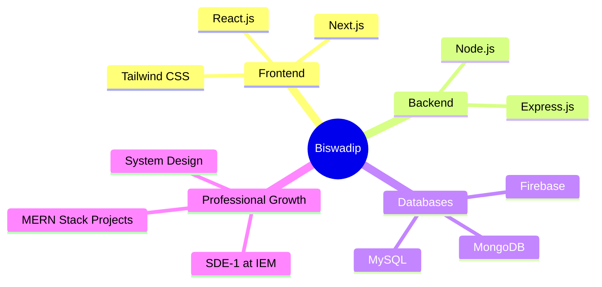

# <span style="color: #e1e5e9;">Hi there, I'm Biswadip! 👋</span>

<div align="center">
  
</div>

<p align="center">
  
  
</p>

---

## <span style="color: #e1e5e9;">🌟 About Me</span>

<div style="color: #e1e5e9;">

> *"Crafting exceptional web experiences with modern technologies and clean code"*

🚀 **Software Development Engineer - I** at **IEM**  
💡 Full-stack JavaScript developer specializing in React, Next.js, and Node.js  
🎯 Passionate about creating responsive, user-centric web applications  
✨ Problem-solving enthusiast with a positive mindset and continuous learning approach  

```javascript
const biswadip = {
    pronouns: "He/Him",
    role: "SDE-1",
    company: "IEM",
    location: "Kolkata, West Bengal",
    specialization: ["React.js", "Next.js", "Node.js", "Full-Stack Development"],
    currentlyLearning: "Advanced System Design & Modern Web Architecture",
    motto: "Build fast, scale smart, design beautiful",
    availableForHire: true
};
```

</div>

---

<div align="center" style="color: #e1e5e9;">

## 🛠️ Tech Stack & Tools

### 💻 Languages


### ⚡ Frameworks & Libraries


### 🗄️ Databases


### 🔧 Tools & Design


</div>

---

## <span style="color: #e1e5e9;">📊 GitHub Analytics</span>

<div align="center">
  
  
</div>

<div align="center">
  
</div>

---

## <span style="color: white;">🎯 Current Focus</span>

<div style="color: white;">



</div>

---

## 🏆 My Contributions & Expertise

<div style="color: #e1e5e9;">

- 🚀 **Software Development Engineer (SDE-1)** at IEM, building scalable web applications
- ⚡ **MERN Stack Developer** specializing in MongoDB, Express.js, React.js, and Node.js
- 🎨 **Modern Web Developer** with expertise in Next.js and Tailwind CSS for stunning UI/UX
- 💾 **Database Architect** experienced with Firebase, MySQL, and MongoDB
- 🔧 **Development Workflow Expert** using Git/GitHub for version control
- 📱 **UI/UX Designer** creating pixel-perfect designs with Figma
- 🌱 **Full-Stack JavaScript Enthusiast** building end-to-end MERN applications
- 💡 **Problem Solver** with strong analytical skills and passion for clean code

</div>

---

## <span style="color: #e1e5e9;">🎮 When I'm Not Coding</span>

<div align="center" style="color: #e1e5e9;">

| 💃 **Dancing** | 🌐 **Internet Surfing** | ♟️ **Chess** |
|:---:|:---:|:---:|
| <span style="color: #e1e5e9;">Expressing creativity through movement</span> | <span style="color: #e1e5e9;">Exploring the digital world</span> | <span style="color: #e1e5e9;">Strategic thinking and planning</span> |

| 🎵 **Music** | 📺 **News** | ✈️ **Traveling** |
|:---:|:---:|:---:|
| <span style="color: #e1e5e9;">Fuel for coding sessions</span> | <span style="color: #e1e5e9;">Staying informed about the world</span> | <span style="color: #e1e5e9;">Exploring new places and cultures</span> |

</div>

---

## <span style="color: #e1e5e9;">📈 Contribution Graph</span>

<div align="center">
  
</div>

---

## <span style="color: #e1e5e9;">🤝 Let's Connect & Collaborate!</span>

<div align="center">

[](https://www.linkedin.com/in/biswadip-saha-ba0b90268/)
[](https://www.instagram.com/commonguy.codes/)
[](https://github.com/TheBiswadipSaha)
</div>

---

<div align="center" style="color: #e1e5e9;">

### 💡 *"Every line of code is a step towards innovation. Let's build the future together!"*


**⭐ From [Biswadip](https://github.com/TheBiswadipSaha) - Always open to exciting projects and collaboration opportunities!**

</div>

---

<div align="center">
  
</div>
