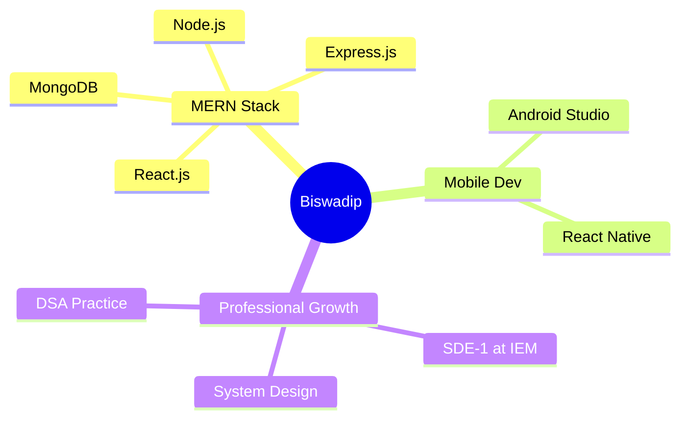

# Hi there, I'm Biswadip! 👋

<div align="center">
  
</div>

<p align="center">
  
  
</p>

---

## 🌟 About Me

> *"Turning complex problems into elegant solutions, one commit at a time"*

🚀 **Software Development Engineer - I** at **IEM**  
💡 Full-stack developer passionate about creating scalable web applications  
🎯 Always learning, always growing, always coding with a smile  
✨ Positive mindset enthusiast who sees opportunities in every challenge  

```javascript
const biswadip = {
    pronouns: "He/Him",
    role: "SDE-1",
    company: "IEM",
    location: "Kolkata, West Bengal",
    passion: "Building seamless user experiences",
    motto: "Code with purpose, debug with patience",
    availableForHire: true
};
```

---

## 🛠️ Tech Stack & Tools

<div align="center">

### 💻 Languages


### 🎨 Frontend


### ⚙️ Backend & Database


### 🔧 Tools & Platforms


</div>

---

## 📊 GitHub Analytics

<div align="center">
  
  
</div>

<div align="center">
  
</div>

---

## 🎯 Current Focus



---

## 🏆 Achievements & Highlights

- 🚀 **Software Development Engineer** at IEM
- 💻 **MERN Stack Specialist** with production experience
- 🎨 **Full-Stack Developer** passionate about user experience
- 🧠 **Problem Solver** with strong analytical skills
- 🌱 **Continuous Learner** staying updated with latest tech trends

---

## 🎮 When I'm Not Coding

<div align="center">

| 💃 **Dancing** | 🌐 **Internet Surfing** | ♟️ **Chess** |
|:---:|:---:|:---:|
| Expressing creativity through movement | Exploring the digital world | Strategic thinking and planning |

| 🎵 **Music** | 📺 **News** | ✈️ **Traveling** |
|:---:|:---:|:---:|
| Fuel for coding sessions | Staying informed about the world | Exploring new places and cultures |

</div>

---

## 📈 Contribution Graph

<div align="center">
  
</div>

---

## 🤝 Let's Connect & Collaborate!

<div align="center">

[](https://linkedin.com/in/yourprofile)
[](https://yourportfolio.com)
[](mailto:your.email@gmail.com)
[](https://github.com/yourusername)

</div>

---

<div align="center">

### 💡 *"Every problem is an opportunity in disguise. Let's build something amazing together!"*


**⭐ From [Biswadip](https://github.com/yourusername) - Always open to interesting conversations and collaboration opportunities!**

</div>

---

<div align="center">
  
</div>
